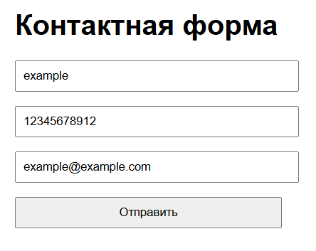
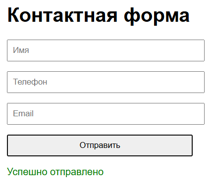
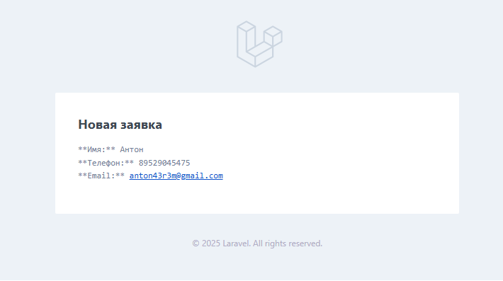

# Форма с отправкой данных на Email

Простое Laravel-приложение с отправкой данных с формы на email. Данные отправляются через AJAX-запрос, сохраняются в базу данных и пересылаются на email.

## 📦 Основной функционал:

- Отправка формы с полями: **Имя**, **Телефон**, **Email**
- Валидация на сервере
- Сохранение в БД (с мягким удалением)
- Отправка email админу
- AJAX-запрос (без перезагрузки страницы)

## 🛠 Шаги установки:

1. Клонировать проект:

```bash
git clone https://github.com/your-username/contact-form.git
cd contact-form
```

2. Установить зависимости:


```bash
Копировать
Редактировать
composer install
```

3. Создайть .env:

```bash
cp .env.example .env
```

4. Настроить .env:

```ini
MAIL_MAILER=smtp
MAIL_HOST=smtp.gmail.com
MAIL_PORT=587
MAIL_USERNAME=your_email@gmail.com
MAIL_PASSWORD=your_app_password
MAIL_ENCRYPTION=tls
MAIL_FROM_ADDRESS=your_email@gmail.com
MAIL_FROM_NAME="Имя отправителя"
MAIL_TO_ADRESS=receiver_email@example.com
```

👉 **Важно**: В качестве MAIL_PASSWORD нужно использовать пароль приложения Gmail, а не обычный пароль от почты. Подробнее как создать его [тут](https://www.uiscom.ru/academiya/spravochnyj-centr/emeyltreking/kak-sozdat-parol-dlya-prilozheniya/).

5. Сгенерировать ключ приложения:

```bash
php artisan key:generate
```

6. Выполнить миграции:

```bash
php artisan migrate
```

🧼 Дополнительно
+ Используется мягкое удаление (softDeletes)

+ AJAX на чистом JS (Fetch API)

+ Простая стилизация формы

## 💻 Скриншоты:




